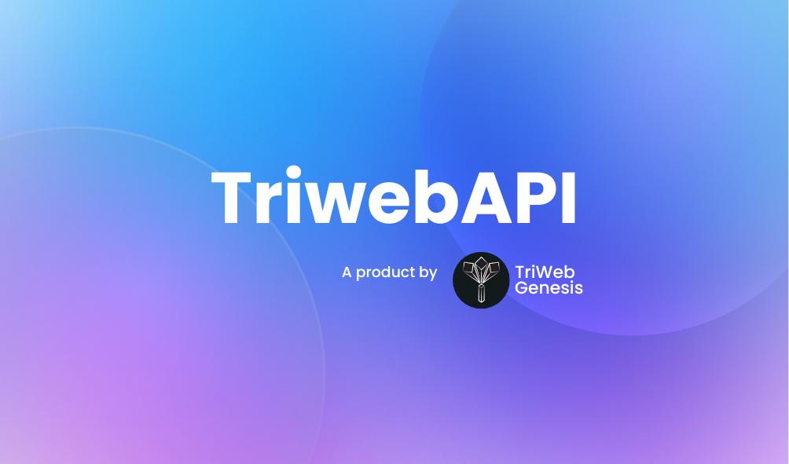

<h1 style="color:blue;text-align:center">Triweb Learning</h1>

                                                    
This is a MERN stack internship.In this internship I get familiar with different-different technoligies related to Web Development like HTML, CSS, Javascript,NodeJS and so on.

# Tech Used

<h2>How to Progress</h2>

I putted my work in different folders. Particular folder name is related to the technology in which I have worked or practice.For eg- In HTML folder I putted all my work that I learn and practice HTML concepts. Move to the particular folder to access particular technology's stuff and concepts.

<h4>Links to particular Folder readme</h4>

[● HTML](./HTML/README.md) : Learn how to design a layout, how to work with table and forms.

[● CSS](./CSS/README.md): Learn how to customize or design your page using different properties like background, display, color, border,position and so on. Here will come in contact with different stuffs of CSS.

[● Javascript](./Javascript/README.md) : Core concepts of javascript. Here deep dive into JS from basics to advance concepts.

[● Projects](./Projects/README.md) : 

[● MySQL](./MySQL/README.md) : Learn concepts of database and explore mysql queries and implement in your code.

[● ES6](./ES6/README.md) : Advance concepts of JS introduce in ECMA 2015 (ES6). Strong your hand over ES6 features of JS.

[● NodeJS](./NodeJS/README.md) : Get your hands into Backend with Express and learn how to create APIs. Here will get different concepts of Nodejs and basic programming. Build your concepts of programming.

[● MongoDB](./MongoDB/README.md) : Connect your backend or project with database using mongoDB. Here will get different queries in mongoDB and learn how to use them.

[● TypeScript](./TypeScript/README.md) : Dive into typescript. Introduce differnt concepts of typescript like interface, union and so on. Also learn how to create backend in typescript and express.

[● React](./React/README.md) : Very important library of JS for building UI. Will get familiar with react and its concepts like props, hooks, state and so on.